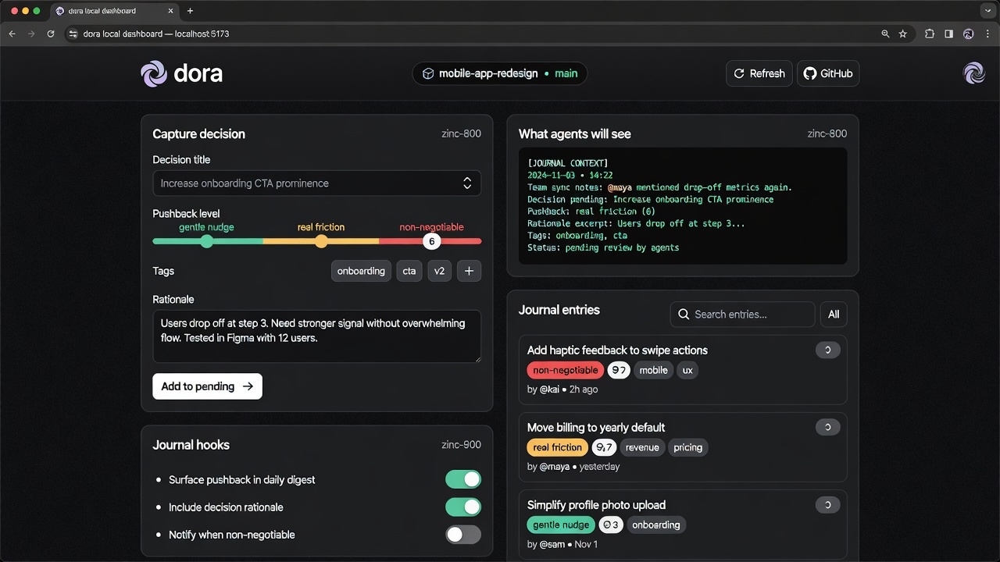

Launch a local web interface for working with your journal.

The interface is sleek, clean, and slightly playful:



The screenshot above shows the current dashboard (as of the latest improvements, including loading states and a working "Open data dir" button).

```bash
dora ui [options]
```

This starts a small local server (default `http://localhost:3737`) with a clean dashboard.

## What it offers

- **Quick capture**: Add new decisions with title, pushback level, tags, and rationale.
- **Live agent context**: See exactly what agents will receive on the next session.
- **Hook management**: Toggle journal injection hooks for Claude (local or global).
- **Entry browser**: Search and review both committed journal entries and staged/pending ones.
- **Modal details**: Click any entry for the full rationale and actions (including deleting staged entries).
- **Loading states**: The dashboard shows progress while fetching data (no more blank screens).
- **Open data dir**: The footer button now actually opens the `~/.doraval` folder in your file manager.

The UI provides a sleek, clean interface (with a touch of playfulness) for quickly capturing decisions and reviewing your journal without leaving the browser.

Heavy operations (full sync, agent enrichment) are still best done from the CLI.

Heavy operations (full sync, agent enrichment) are still best done from the CLI.

## Options

| Flag          | Description                                      | Default     |
|---------------|--------------------------------------------------|-------------|
| `--port`      | Port to run the local server on                  | `3737`      |
| `--host`      | Host to bind to                                  | `127.0.0.1` |
| `--no-open`   | Do not automatically open the browser            | (opens)     |

Example:

```bash
dora ui --port 4000
```

## Requirements

- You should have run `dora init` (or `dora journal init`) at least once so a project is registered.
- The dashboard reads from your local `~/.doraval/` cache and pending directory.

## Tips

- The dashboard polls for changes every few seconds.
- Use the **Refresh** button or just keep the tab open while working in your editor / agent.
- Staged entries (created via the UI or `dora journal add`) are shown with a "staged" label until you run `dora journal sync`.

## See also

- [Agent Journal](/concepts/agent-journal/)
- [journal add](/commands/journal-add/)
- [journal list](/commands/journal-list/)
- [journal sync](/commands/journal-sync/)
